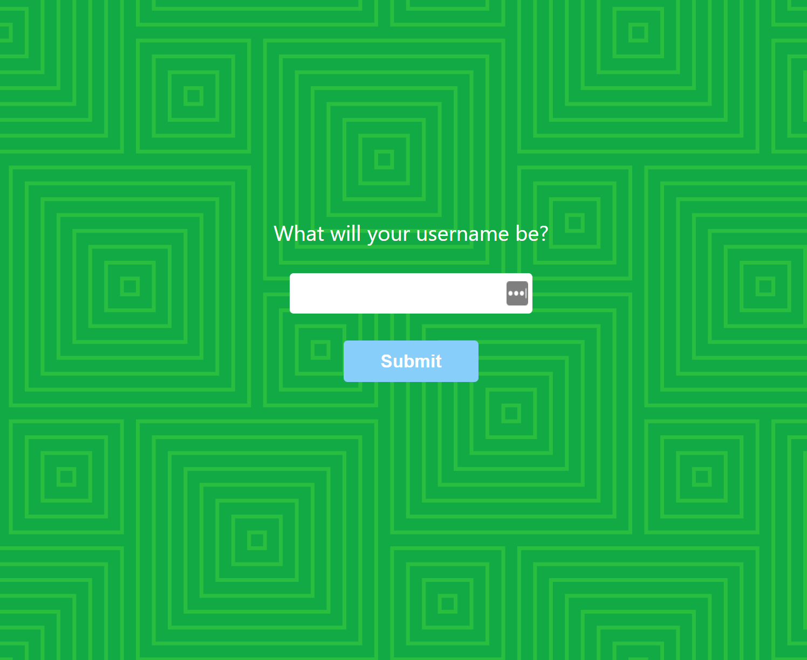
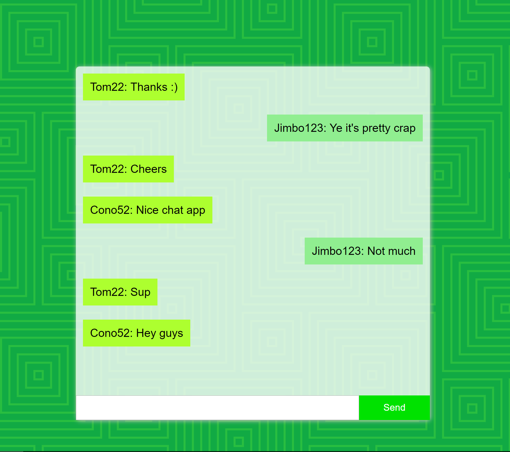
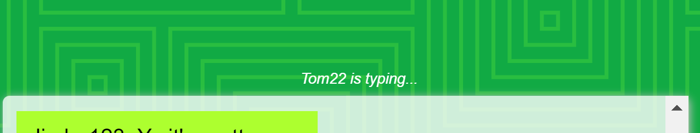

<h2>A basic chat app using socket.io and react.</h2>

Never had an idea for what I wanted to build, beyond a simple chat app, when I first came across socket.io ages ago...and never did SO here it is.

 
<h3>Give a name to join:</h3>

 
 
 
<h3>Have a chat (bottom to top):</h3>

 
 
 
<h3>See who is typing and abuse them for not finishing their sentence or for just taking too long to spit it out:<h3>

